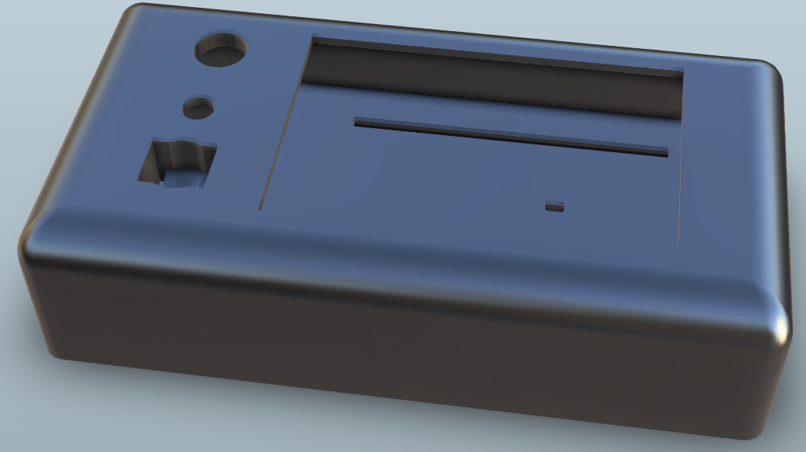
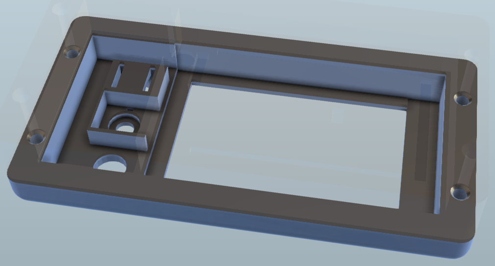

# Hearted Messenger
This repository contains instructions and code to build a small hardware device which shows a random sequence of messages, being both text and pictures.
The messages are stored and read in a simple binary format for space savings. This repository constructs these binaries from a Facebook Messenger chat, filtered on the ❤ reaction and seperated by author.
There's a power button to connect the + line of the battery to the arduino's 5V pin. A potentiometer controls the duration before switching to the next (random) message in the sequence. Its range is 1s-60s, and is infinite if the pot is >95%. Finally, there's a push button to toggle between the two message authors.

## Demonstration

## Usage
### Dependencies
- Arduino
- ImageMagick
- python3
- bash
- lv_font_convert (installed globally with npm)

### Font
The font required some work to get working. For better resemblance to the Messenger look and visual appearance, a variable-width font was required. This requires a lot of work to use the additional pregenerated information for the kerning.
Luckily I found the lv_font_convert tool of the [lvgl](https://github.com/lvgl/lvgl) project. This tool creates C structures with for a predetermined size of the font. The code to work with these structures has been extracted from lvgl itself. Only the necessary font files were copied and modified for this use.

During message baking, a python script creates a list of all the unique characters present in the messages. By feeding these into lv_font_convert a lot of memory is saved.

See the [message baking](#baking) section for an explanation on the baking step. 

Roboto was the font which most resembled Messenger's. I used Font Forge to combine Robot with [Noto](https://fonts.google.com/noto/specimen/Noto+Emoji) for the emojis, which are plentiful in chat conversations.

### Messages
#### Binary Format
The binary format is pretty easy, as it doesn't need to do a lot. It has been created to have fast random access (literally). Integers are big-endian.

The contents of the file are:

| Element | Type |
|---|---|
| N (# messages) | u32 |
| Message Offsets | u32[N] |
| Message Data | Message[] |
The values in the message offsets array determine where a new message starts from the beginning of the message data array. This offsets array is necessary for the random access.

Message is another structure:

| Field | Type |
|---|---|
| Message Type | u8 |
| Message Data | u8[] or u8[12] |

Message Type can be either 0 for text messages, and 1 for an image. The message data for text messages is a null-terminated utf-8 string, whereas for images it is the name of the image filename as baked.

#### Baking
The baking is done with several tools and a python script. The input is the archive of your Messanger chat from facebook.

Downloading the Messenger archive is the zeroeth baking step. In desktop browser:
1. Click on _your profile_, _ Settings and Privacy_ and then _Settings_.
2. In the list on the left, click on _Your Facebook Information_
3. Choose _Download a copy of your information_
4. The _Format_ has to be JSON. _Media Quality_ can probably be low since the display is only 480x320.
5. Deselect everything but _Messages_ so the file size can be vastly decreased and the processing duration on Facebook's end to prepare the archive is way shorter.
6. _Request Download_ at the bottom of the page.
7. Wait untill Facebook notifies you through either facebook itself or email. At this point you have about four days to download the archive.

The first step converts all images, gifs and videos into still frame .bmps. For videos the first frame is used, for gifs the last. This is because most gifs have some setup and their last frame best summarizes their content. Videos are harder to summarize but the first frame seems best. Bmp is a somewhat easy format to parse, although I had some issues initially with the different header versions, compressions and the pixel line alignment to 4 bytes.
The code assumes a certain format for the bmp, but not all of the assumed parameters can be explicitly controlled in ImageMagick. This means the image rendering might break for some images or even break in general in the future.
The generated bmp files are collected in the images/ folder.

The second baking step is the python script to combine and convert the JSON files in the Messenger chat. Messenger creates multiple JSON files for a chat to limit their size. These files contain a lot more information which we won't need for this project.
The script loops through every message, skips it if it doesn't have a ❤ reaction and collects it by author. The filenames in messages that are an image, gif or video message are mapped to an [8.3 filename](https://en.wikipedia.org/wiki/8.3_filename#:~:text=8.3%20filenames%20are%20limited%20to,filenames%2C%20excess%20characters%20are%20ignored.) and their corresponding .bmp file is renamed and copied to a directory of actually used images. In the end, each author's messages are written in the binary format above, and all the unicode codepoints are written to an temporary file.

The final step creates the C structures from the Roboto font for the rendering. The font.sh file contains the instructions to lv_font_convert to create these files with the codepoints from the previous step.

### Circuit

Both the potentiometer and the button work by enabling the internal pull-up resistor of their connected pin. For the potentiometer, this creates a voltage divider where the potential on the input pin at  the max setting of 10k is about 1.1V, the internal reference voltage set in code. For lower resistor values the potential drops, using the full adc range at the input.
The internal pull-up for the button is necessary to distinguish between pressed (0V at the input) and unpressed (1 at the input).
In both cases, the internal pull-up greatly simplifies the design and wiring.

### Case

The case is designed in Fusion 360 and modelled in three parts. 
- The bottom part holds a battery and is drawn for a specific powerbank model. It has a cutout to monitor the battery level. The small basin next to it provides space for the USB A and leftover wiring.
- The base part is to seperate the battery from the arduino and has cutouts to hold the arduino mega in place with its pins.
- The top part has a holes for the screen, the power button, the transition speed potentiometer and the _author toggle_ push button.

The whole is held together by M3x40mm screws. They need M3 thread inserts melted into the Top part's holes.

